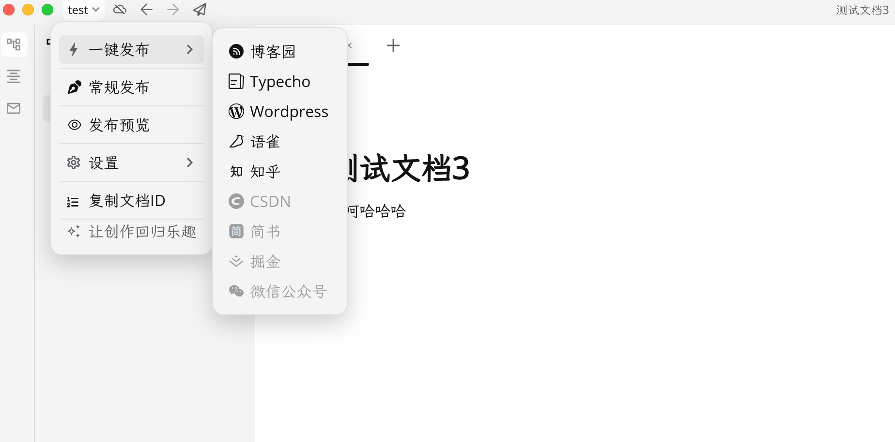

# sy-post-publisher

Publish siyuan article to supported open platforms

At present, it supports vuepress and two open API standard blog platforms, `metaweblog api` and  
`xmlrpc` remote call API based on <code>wordpress</code>

Also provide a [common API adaptor](https://github.com/terwer/src-sy-post-publisher/blob/main/src/lib/api.ts) , make
every plantform posiable.




[Click to see Help doc](https://mp.terwer.space/post/readme-1j4ltp.html)

[Click to see config video](https://mp.terwer.space/post/configure-entry-video-brpm9.html)

## Updates

[Click here to view development progress](https://github.com/users/terwer/projects/1/views/1)

* 0.0.3 key fatures

  Published at 2022-09-28

    * feat: #62 [标题支持数字编号](https://github.com/terwer/src-sy-post-publisher/pull/62)

      例如在思源笔记的标题为 `023.利用pm2后台运行nodejs程序`，发布的时候会自动去掉编号变成 `利用pm2后台运行nodejs程序`。这样做的目的是保持文章在思源笔记的结构化，然后又不影响其他平台的展示。
    * feat: #72 [Wordpress默认发布为Markdown](https://github.com/terwer/src-sy-post-publisher/pull/72)

      这里还做了进一步的优化，现在发布方式支持配置了，可以自定发布为 markdown 还是 HTML，满足不同平台诉求。
    * feat: #76 [动态类型支持选择发布格式](https://github.com/terwer/src-sy-post-publisher/pull/76)

      支持 HTML 和 Markdown 两种发布格式。
    * fix: #73 [发布到语雀偶发的获取默认知识库失败问题](https://github.com/terwer/src-sy-post-publisher/pull/73)
    * feat: #103 [支持可设置分类的平台选择分类-语雀支持选择分类](https://github.com/terwer/src-sy-post-publisher/pull/103)
    * feat: #77 [支持Metaweblog选择分类（博客园、Wordpress等）](https://github.com/terwer/src-sy-post-publisher/pull/77)
    * feat: #81 [支持取消所有平台](https://github.com/terwer/src-sy-post-publisher/pull/81)

      所有平台均支持关闭，不再强制内置任何平台，默认所有平台关闭，用户自行启用。
    * feat: #88 [适配暗色模式](https://github.com/terwer/src-sy-post-publisher/pull/88)​

      现在所有页面都支持暗色模式和浅色模式切换
    * feat: #89 [整合node-siyuan到挂件【非挂件模式】](https://github.com/terwer/src-sy-post-publisher/pull/89)​

      非挂件模式提供文章列表页面，整合我的另外一个 node-siyuan 项目。
    * feat: #99 [Google插件扩展](https://github.com/terwer/src-sy-post-publisher/pull/99)​

      现在可以直接在 Google Chrome 插件扩展中使用了。
    * feat: #102 [代码优化以及空状态处理](https://github.com/terwer/src-sy-post-publisher/pull/102)​

      现在支持加载过程中展示骨架，提供更好的体验。
    * feat: #104 [动态类型支持自定义预览地址](https://github.com/terwer/src-sy-post-publisher/pull/104)​

* 0.0.4 preview

  Will publish on 2022-12-31

    * [ ] 支持发布到印象笔记
    * [ ] 支持详情页导出Anki记忆卡【非挂件模式】
    * [ ] 支持微信消息、微信公众号、CSDN、简书、知乎（预研，目前没有公开API，可能需要借助cookie模拟登陆）
    * [ ] 支持Github pages、HUGO、Jekyll、Next.js content、Nuxt.js content
    * [ ] 集成PicGO，可直接粘贴图片自动上传。旧文档的非图床图片，在发布时候使用PicGO上传然后再发布
    * [ ] 详情页支持下载所有图片到本地，并打包成带assets文件夹和md文件的zip包，这个主要是某些分享场景网络不畅通可能有用
    * [ ] 支持发布时候选择一键剔除外链图片，主要是个别平台不允许外链图片

[Full changelog](Changelog-en-US.md)

## Support plantforms

* [X] Vuepress
* [X] Cnblog
* [X] Liandi
* [X] Yueque
* [X] Wordpress
* [X] Metaweblog API

## Tool Version

Vue 3 + TypeScript + Vite

|Tool|Version|
| ------| --------|
|node|v16.16.0|
|yarn|1.22.19|
|vercel|28.0.1|
|pm2|5.2.0|

## Environment

**Set up environment variables**

Copy the .env.local.example file in this directory to .env.local (which will be ignored by Git):

```bash
cp .env.local.example .env.local
```

Then open `.env.local` and set SIYUAN_API_URL to be the URL to your siyuan-note endpoint. For
example: http://127.0.0.1:6806.

Your `.env.local` file should look like this:

```properties
# log level
VITE_LOG_INFO_ENABLED=false
# siyuan api
VITE_SIYUAN_API_URL=http://127.0.0.1:6806
VITE_SIYUAN_CONFIG_TOKEN=
# middlware to support cors, optional
# VITE_MIDDLEWARE_URL=
```

You can also set `.env.development.local`, `.env.production.local`, `.env.test.local` for different modes

See also [Vite .env docs](https://cn.vitejs.dev/guide/env-and-mode.html#env-files)

## Devlopment

setup

```bash
npm i -g yarn
npm i -g vercel
```

dev

```bash
# yarn create vite
yarn
yarn vdev
```

**Notice:**

If you find vervel is not well for hot reload，you can try this way，But env `VITE_MIDDLEWARE_URL` should be set to support CORS

```properties
VITE_MIDDLEWARE_URL=https://publish.terwer.space/api/middleware
```

Then start with following commonds which supports hot reload

```bash
yarn dev
```

View URL is:

http://localhost:3000/blog/index.html

## Deploy

### Build for siyuan widget

```bash
yarn w
```

### Build for chrome extension

```bash
yarn e
```

### Run with pm2

setup

```bash
npm i -g yarn
npm i -g vercel
npm i -g pm2
```

start

```bash
yarn pm2
```

stop

```bash
yarn pm2s
```